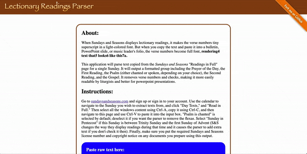

# **Readings Parser**

A parser with a single-page UI for parsing text copied off of Sundays and Seasons. Creates clean copies of lectionary texts for use in bulletins, PowerPoint presentations, or leader sheets, with the option to make the Psalm chanted or spoken. Also parses differently depending on whether the user indicates the raw text is from the season of Pentecost or not.

Try it yourself **[here](https://stephenobaker.github.io/reading-parser/)**, or take a look at the GIF example below:

